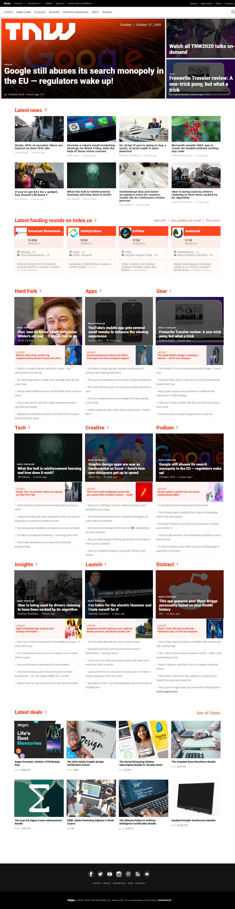
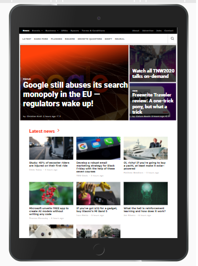
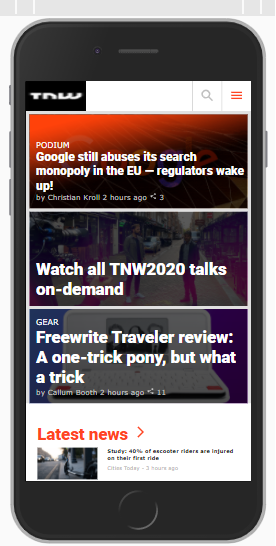

# Responsive Design 
## Responsive Home Page of the Next Web home page

This repository contains a project which consists of a responsive clone of The Next Web home page.

## Below are the screenshots of the completed project

### Desktop Version

### Tablet Version

### Mobile Version

## Built With

- HTML
- CSS
- ionic icons
- Google fonts

## Below is the Live link to th next web home page

[The Next Web home page Link](https://gango-anan.github.io/the-next-web-clone/.)

## Getting Started

### To run this project:
- Install a web browser of your choice prefferably Google chrome or mozilla firefox.
- Launch your webserver and
- Copy the project files to the webserver folder
- Open your browser and launch the index.html file
- Thank you.

## Authors
👨🏻‍💻 **Galiwango Ananiya**
- GitHub: [@gango-anan](https://github.com/gango-anan)
- Twitter: [@gango_anan](https://twitter.com/gango_anan)
- LinkedIn: [@galiwango-ananiya](https://www.linkedin.com/public-profile/settings?trk=d_flagship3_profile_self_view_public_profile)

👨🏻‍💻 **Mohd Nayeem Shah**
- GitHub: [@shahnaeem](https://github.com/shahnaeem)
- Twitter: [@mohdnayeemshah1](https://twitter.com/MOHDNAYEEMSHAH1)
- LinkedIn: [@mohd-nayeem-shah-97a590152](https://linkedin.com/in/mohd-nayeem-shah-97a590152)

## 🤝 Contributing

Contributions, issues, and feature requests are welcome!

Feel free to check the [issues page](https://github.com/gango-anan/the-next-web-clone/issues).

## Show your support

Give a ⭐️ if you like this project!

## Acknowledgments

- To make this project a success a lot of sources were used especially google, youtube, css trick website, MDN reference and above all the positive reviews from our respective standup teams, we would like to thank all those who authored the articles we used and a big thank you to our stand up teams.

## 📝 License

This project is [MIT](https://github.com/gango-anan/the-next-web-clone/new/home-page) licensed.
